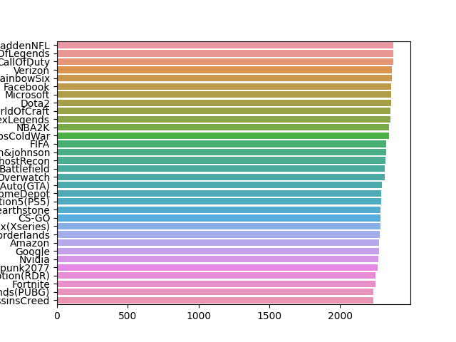
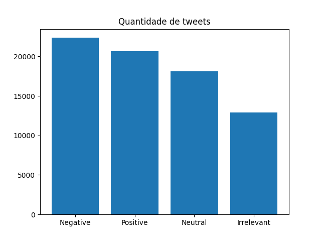

# TWITTER
## Sumário
* Introdução
* Pré-Processamento
* Modelagem
* Ferramentas

## Introdução
Esse é um projeto de NLP voltado para à analise de sentimento com tweets. Os tweets usados foram obtidos do site Kaggle. O gráfico abaixo mostra os assuntos e quais os tem  mais e menos menções

Os tweets tem os seguintes rotulos:**Positivos**, **Neutro**, **Irrelevante** e **Negativo**. Os rotulos são distribuidos da seguinte forma:

 

## Pré-Processamento

Antes de ir para a etepa de classficação os tweets passaram pela etapa de prè-processamento. Isso era necessário para remover emojis e caracteres especiais presentes nesse tipo de texto e  que poderia prejudicar o processso de classificação.

A primeira etapa do processos foi a de tokenização. Ela consiste em dividir uma frase nas palavra qua a compõe. A maneira como a tokenização foi feita não só para separa as palvras mas pra eliminar a pontuação e caracteres.

Depois disso, o as palavras vão para o processo de limpeza. Para isso, palavra que não possuem significados para o modelo foram removidas. Essas palavras são chamadas de stop words.

Ápos isso, as palavras foram padronizadas pelo processo de lammatização, ou seja as palavras foram colocadas na forma do  seu  radical. Depois as palavras foram colocadas em minuscula e finalizado o processamento de pré-processamento.

## Modelagem

Com os tweets tratados, precisamos transformar-los em vetor. O metodo escolhido para isso foi word embedding. Isso significa que cada palavra sera representada como um vetor pequeno e denso. Onde palavras com significados parecido terao vetores parecidos. Para desenvolver foi criado um modelo que aprendesse o melhor vetor para cada palavra.

Depois o resultado segue para a seguinte sequencia: uma camada LSTM, uma camada Dense, outra camada Dense e outra de softmax.

Seguindo esses passos obtiveram os resultados:

* acuracia:0.89
* precisao:0.89
* revocacao:0.88
* f1-score:0.89 

## Ferramentas
Para criar esse projeto usou as seguintes ferramentas:

* Linguagem python;
* spacy ;
* nltk ;
* matplotlib;
* seaborn;
* tensorflow;
* gensim;